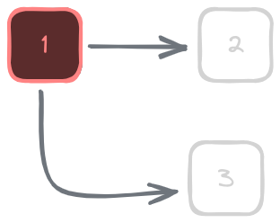
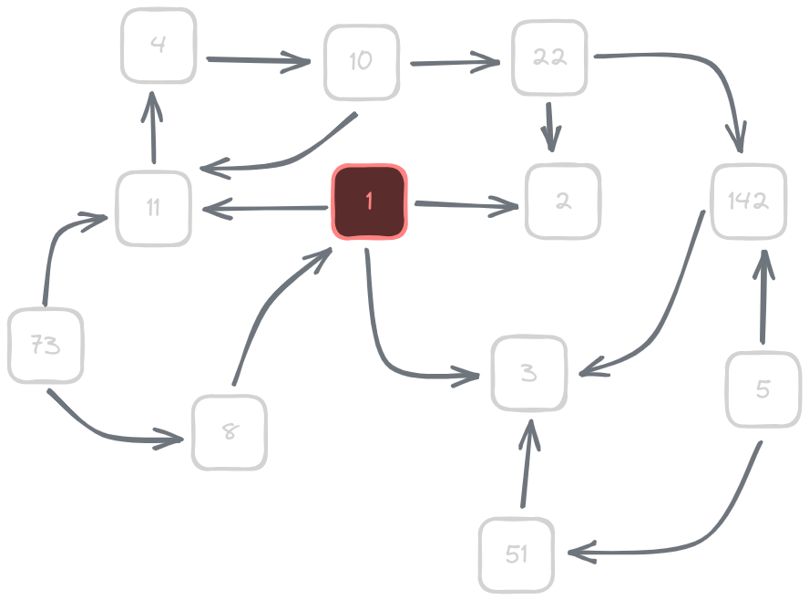
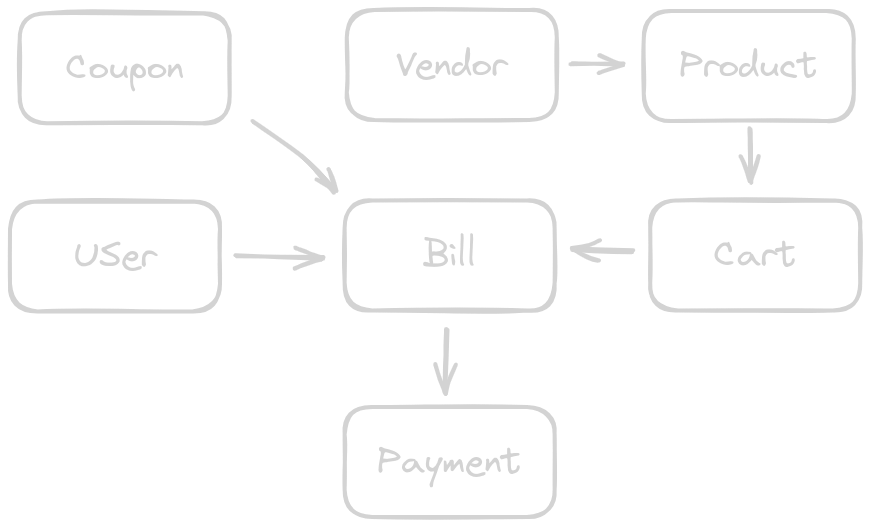
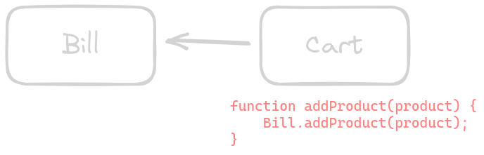
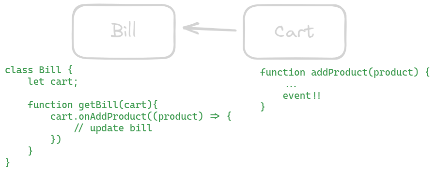

# Reactive Programming

---

## Introduction

- Reactive programming is a programming paradigm focused on **data streams** and the propagation of changes.
- It provides a declarative and composable way to handle **asynchronous** and **event-based** systems.
- The reactive approach promotes **responsive**, **resilient**, and **scalable** applications.

---

## Main Problem

What's the first thing that comes to mind when you have this dependency tree?



---

And this one?



---

This is one of the **major issues** we encounter when our components are not self-contained in their functionality and constantly rely on other components.

---

## How can we fix this?

We can transfer the responsibility to each component, but how?

---

#### Let's see an example: Shopping Cart!



---

#### Let's simplify it.


---

## Imperative Version



<div class="columns">
<div>
</div>
<div>

```js
function addProduct(product) {
  Bill.addProduct(product);
}
```
</div>
</div>

---

## More Reactive Version



<div class="columns">
<div>

```js
class Bill {
  let cart;

  function getBill(cart) {
    cart.onAddProduct((product) => {
      // Update bill
    });
  }
}
```
</div>
<div>

```js
function addProduct(product) {
  ...
  // event!!
}
```
</div>
</div>

---

## Fully Reactive Version

```javascript
function bill(products: Observable<Products>) Observable<Float> {
    return products.reduce((acc, product) => {
        acc += product.price
    }, 0)
}
```

---

Notice that in this final version, we don't need the Bill class. We have a single function that performs a specific task using observables asynchronously.

---

> Self-updates listening to events.

---

## Key Concepts

- **Data Streams**: Sequences of values over time.
- **Observers**: Entities that react to changes in the data streams.
- **Pure Functions**: Functions that produce the same output for the same input, without side effects.

---

## Reactive Principles

1. **Responsiveness**: React quickly to data changes.
2. **Resilience**: Handle errors gracefully and recover.
3. **Scalability**: Scale efficiently with high data volumes.
4. **Message-driven**: Communicate through asynchronous messages.

---

5. **Composition**: Compose operations to create complex behaviors.
6. **Backpressure**: Control the rate of data flow to avoid overwhelm.
7. **Hot vs. Cold**: Distinguish between active and passive data streams.
8. **Time**: Leverage time as a first-class citizen.

---

## Imperative Code vs. Reactive

<div class="columns">
<div>

```javascript
// Imperative Code
let result = 0;
for (const number of numbers) {
  if (number % 2 === 0) {
    const doubled = number * 2;
    result += doubled;
  }
}
```

</div>
<div>

```javascript
// Reactive Code
const result$ = numbers$
  .filter((x) => x % 2 === 0)
  .map((x) => x * 2)
  .reduce((acc, x) => acc + x, 0);
```

</div>
</div>

---

## Common Operators

**Transforming Operators:**

- `map()`: Transform values.
- `flatMap()`: Flatten nested observables.
- `scan()`: Accumulate values over time.
- `mergeMap()`: Map and merge multiple observables.

---

## Common Operators (contd.)

**Filtering Operators:**

- `filter()`: Filter values based on conditions.
- `distinct()`: Emit unique values.
- `takeUntil()`: Take values until a condition is met.
- `debounceTime()`: Delay emission of values.

---

## Common Operators (contd.)

**Combining Operators:**

- `combineLatest()`: Combine values from multiple streams.
- `merge()`: Merge multiple streams into one.
- `concat()`: Concatenate values from multiple streams.
- `zip()`: Combine corresponding values from multiple streams.

---

## Common Operators (contd.)

**Math Operators:**

- `sum()`: Calculate the sum of values.
- `min()`: Find the minimum value.
- `max()`: Find the maximum value.
- `average()`: Calculate the average of values.

---

## ReactiveX

- ReactiveX (Rx) is a popular library for reactive programming.
- Provides implementations in various languages (e.g., RxJava, RxJS).
- Offers a rich set of operators and abstractions for working with data streams.

---

## Libraries for Reactive Programming

- **RxJava**: Reactive extensions for Java.
- **RxJS**: Reactive extensions for JavaScript.
- **ReactiveSwift**: Reactive extensions for Swift.
- **ReactiveUI**: Reactive extensions for .NET.
- **Akka**: Actor-based framework supporting reactive programming.

---

## Conclusion

- Reactive programming enables building responsive and scalable applications.
- It leverages the power of data streams, observers, and pure functions.
- ReactiveX and other libraries provide valuable tools for implementing reactive systems.

---

## Questions?

---

## Thank You!

---
